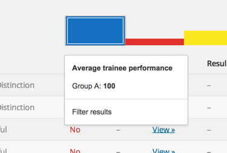

Archive
=======

The archive stores Trainee's Test [Results](results.md) over time. This means that even if you were to delete a Test Result, you won't actually lose their mark information – A Trainee's performance is forever associated with them in the system.

The archive lets you:

* See what tests a trainee has taken
* See how many attempts at a test a trainee has had
* See the actual answers a trainee made
* See a line graph of the [trainee's performance](#trainee-performance) over time
* See a bar chart of how well the [groups are performing](#group-performance) for a given test
* Download a CSV
* Filter/reorder the archive

##### Trainee performance

##### Group performance

##### Tin Can
The Tin-Can API, aka The Experience API is a standardised way of recording a users learning experiences. These experiences get stored in what's known as an LRS (Learning Record Store), the point of which is to allow a user's learning progress to be associated with them, across multiple services (not just Train-Up!). See [here](tin_can.md) for more info.
