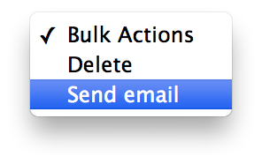

Emailer
=======

Train-Up! makes it easy to give users feedback on their test [results](results.md). Because of this, it also includes a bulk-action emailer to help you quickly and easily send out a notification to [trainees](trainees.md) that their test results are now available.

##### Shortcodes
The shortcodes available in the emailer correspond directly to the fields that a WordPress user has and can be used in the body or subject line.

For example:

	[known_user]
		Dear [first_name]
	[/known_user]

	[!known_user]
		Hiya
	[/known_user]
	
##### Demo

<iframe width="560" height="315" src="http://www.youtube.com/embed/1GceTNNCHMk?HD=1;rel=0;showinfo=0&#038;vq=hd720" frameborder="0" allowfullscreen></iframe>