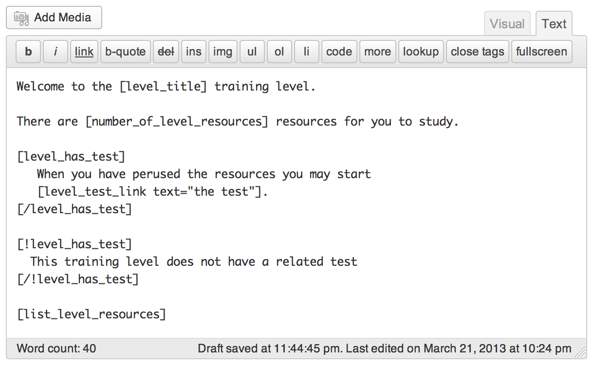

Levels
======

Levels are a custom post type which are the entry point for [Trainees](trainees.md) to a collection of [Resources](resources.md) and the optional [Test](tests.md).

Because levels are just a page, you can utilize WordPress' `menu_order` property and nesting to create e-learning courses with a hierarchy of your choice. For example:

* Geography (Level 1)
  * Volcanoes (Level 1.1)
  * Earthquakes (Level 1.2)

##### Restricting access
Access to levels can be limited to a subset of trainees by assigning it to one or more [Groups](groups.md). Additionally, you can specify one or more tests that a trainee must have passed before they are able to access it.

##### Relationships
Training Levels have special ties with [Resources](resources.md), [Test](tests.md) and [Test-Results](results.md). Because of this, they can inherit some of the Level's properties. For example: If you created a Training Level to teach _Geography_ with two sub-levels _Volcanoes_ and _Earthquakes_. You could set a Featured Image on the Geography Level, and its sub levels will automatically display the same image unless they were assigned one themselves.

##### Screenshot of creating a Level

##### Video

