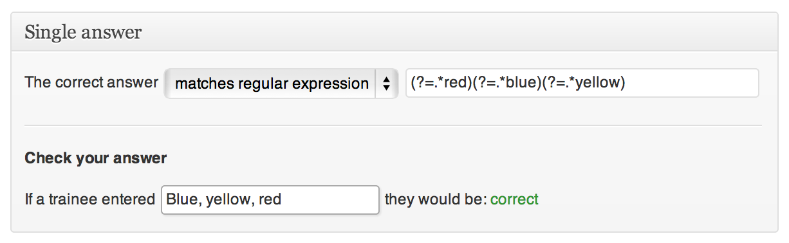

Questions
=========

Train-Up! comes with two built-in question types: Multiple choice, or Single-answer.

What makes Train-Up! so powerful is that you are not limited to just these two, through the use of [add-ons](../README.md#add-ons) you can add other types of questions to make your tests really interesting.

##### Question types

Built-in        | Add-ons
----------------|--------------------
Single answer   | Fill in the blanks
Multiple choice | Sort order
                | Essay
                | File attachments
                | [Your custom question type]
                
##### Rule based system
For questions that require users to respond with a single answer, you can use the following rules:

* Equal to
* Greater than
* Greater than or equal to
* Less than
* Less than or equal to
* Contains
* Between
* Matches pattern

##### Pattern matching
To help with this, there is a Question-checker tool so you can see what a user must enter in order to get the question correct. Imagine the question:

     What are the primary colours?
     

<iframe width="560" height="315" src="http://www.youtube.com/embed/A9Qkv8dDbd8?HD=1;rel=0;showinfo=0&#038;vq=hd720" frameborder="0" allowfullscreen></iframe>