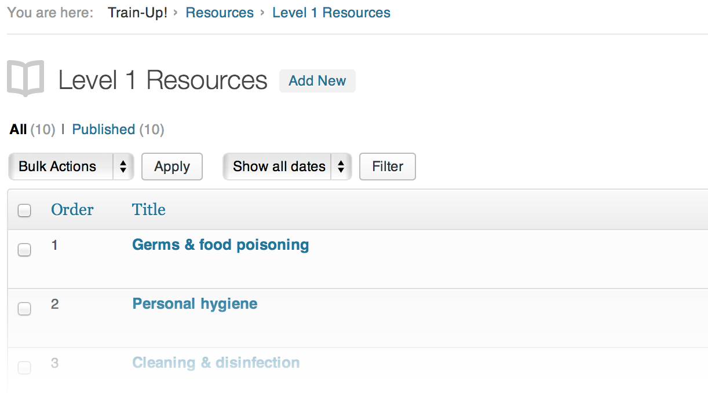
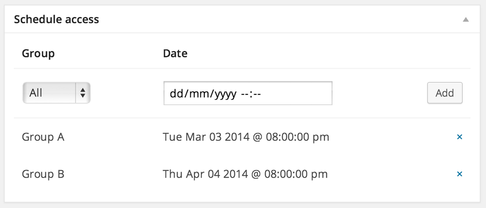

Resources
=========

Each [Level](levels.md) gets its own resource post type, thereby giving you greater control over the assets associated with each level.

_i.e._ Instead of dumping all your e-learning content in WordPress > Pages, you get distinct sections (notice the breadcrumb trail in the screenshot below).

Because resources are just WordPress posts, they can contain any type of content that you want the [Trainee](trainees.md) to study before then starting the associated [Test](tests.md).

You can use the arrow keys navigate through training resources.

##### Scheduling
Resources can be scheduled to become available at a specific date/time. This allows you to 'drip feed' content to your users. You can even schedule content based on specific Groups, for example you may wish to release a Resource to Group A before Group B.

##### Resuming studying
When a user accesses a resource it is marked as visited so they can resume their position when studying.

Using the `[list_level_resources]` shortcode adds a class to each list item to allow styling of visited resources. Alternatively developers can use:

	$trainee = Trainees::factory('joe@bloggs.com');
	echo $trainee->has_visited_resource(37);

##### Video

