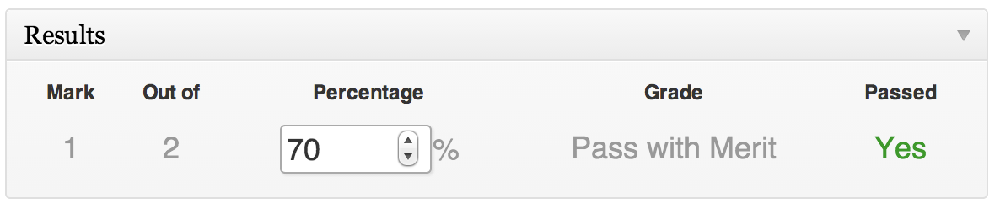

Results
=======

Whenever a [Trainee](trainees.md) finishes a [Test](tests.md), a [Result](results.md) post is created specifically for that user and will show up in their account. This can be thought of as their 'certificate'. It can either be published instantly, or manually after the trainee's answers have been reviewed.

Because results are just posts, administrators or [Group managers](group_managers.md) can give special feedback to individual trainees. For example if Sally Smith is struggling with trigonometry then advice and feedback can be given specifically to her by editing their result post, or by leaving a comment on it.

The trainee's answers are [archived](archive.md), and an answer-sheet its generated to quickly show which questions they got wrong.

##### Emailer

To help with manually processing results, the plugin comes with a [bulk-action emailer](emailer.md) which lets you email one or more trainees, or even a whole group, or a batch of groups. The emailer also has shortcodes so you can personalise each email.

##### Manually marking

Sometimes it is not possible for Train-Up! to automatically mark a question (for example with Essays or File attachments). In such cases, you may wish to manually set the percentage score. To do this, just click their percentage:

__Please note__: If you do manually adjust a Trainee's Result then the "Marks" and "Out-Of" field is redundant.