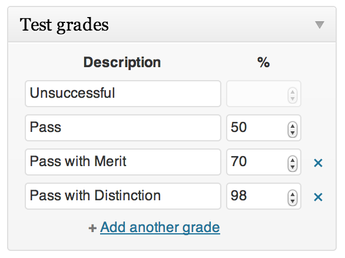

Tests
=====

Each [Level](levels.md) may optionally have a Test and each test gets its own [Question](questions.md) post type, thereby giving you the ability to create really dynamic questions.

##### Grades
Just like 'real life' tests, each one can be graded differently. For example: You may wish to have a simple Pass/Fail if a [Trainee](trainees.md) gets over 50%. But for other tests you may wish to offer 'Pass with distinction' if they were to do extra specially well.

##### Re-sits
Tests can be re-sat by users who do not pass first time. This is optional of course, and can be limited. Their re-sits are [archived](archive.md) as well, but only their most recent attempt is available as a [Result](results.md) post viewable by the trainee themselves.

##### Time limits
Time limits can easily be enforced when Trainees are taking a Test. When the time is up, the Trainee's answers will be submitted automatically.

A countdown timer can be displayed on the Test, (and its Questions) by using the relevant shortcode or by adding the classname tu-time-remaining to an HTML element.

##### Resetting a test
Just like in real life, once a test has been started, it would be unfair if you were to change it mid-way through. Therefore in Train-Up! you are not allowed to edit a Test when Trainees are taking it.

However, you do have the ability to 'Reset' the test. This is effectively the same as throwing away everybody's test papers so that they have to start again. Obviously ill advised, but a useful feature in some circumstances.

