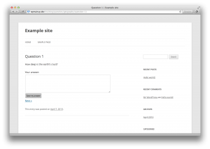
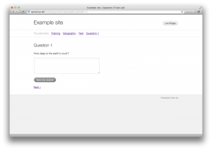
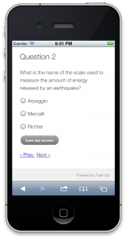

Theme
=====

A default theme is provided **within** the plugin itself. This means that you can use it on its own _OR_ in conjunction with your existing sites' theme without affecting it. The options are:

* Use your existing theme for your site and the /training section
* Use your existing theme for your site and use the built-in theme for the /training section
* Use the built-in theme for your site and the /training section

###### Any theme

###### Built-in theme

###### Built-in theme on a mobile device

##### Customisation
Special care has been taken to make sure that the markup generated by Train-Up! is as flexible as possible for WordPress developers, without including unnecessary styles and scripts.

Train-Up! templates can be overridden by creating files inside your theme folder. e.g `tu_level.php`

This [special theme](https://github.com/amk221/train-up.simple-theme) might come in useful for developers who wish to have *purely* a training site, i.e. they only need the functionality provided by Train-Up! in the /training section. This is a recommended for getting an e-learning site up and running really quickly.