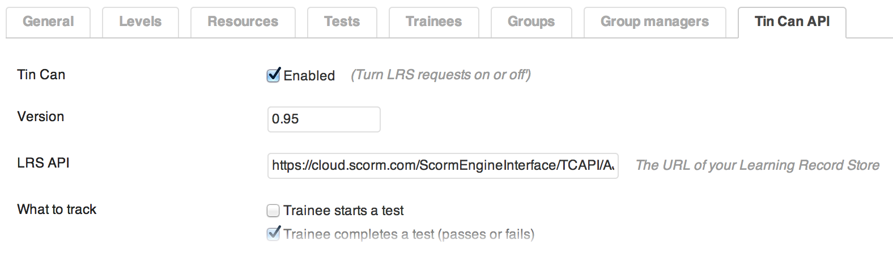

Tin Can API
===========

The Tin-Can API, aka The Experience API is a standardised way of recording a users learning experiences. These experiences get stored in what's known as an LRS (Learning Record Store), the point of which is to allow a user's learning progress to be associated with them, across multiple services.

To be clear – as a WordPress Plugin, Train-Up! does not require a third party LRS to function, it simply uses WordPress' database to store information (See the [Archive](archive.md)).

However, if you wish you can enable tracking of certain events within Train-Up! For example: When a [Trainee](trainees.md) completes a [Test](tests.md) a Tin Can API Statement can be generated and sent to your LRS of choice.

	Please note that the Tin Can API functionality within Train-Up! is a work in progress and requires more feedback from the community.

##### Settings screen

##### Example usage
From the above screenshot you can see that Train-Up! will send Tin Can API statements to your LRS of choice automatically. However if you wish to do this manually, or customise the information sent, you can do so easily.

	// Convert the WordPress post to a Tin Can activity:
	$test = Tests::factory(123)->as_tin_can_activity();

	// Send the statement to the LRS
	$statement->object = $test;
	$statement->create();